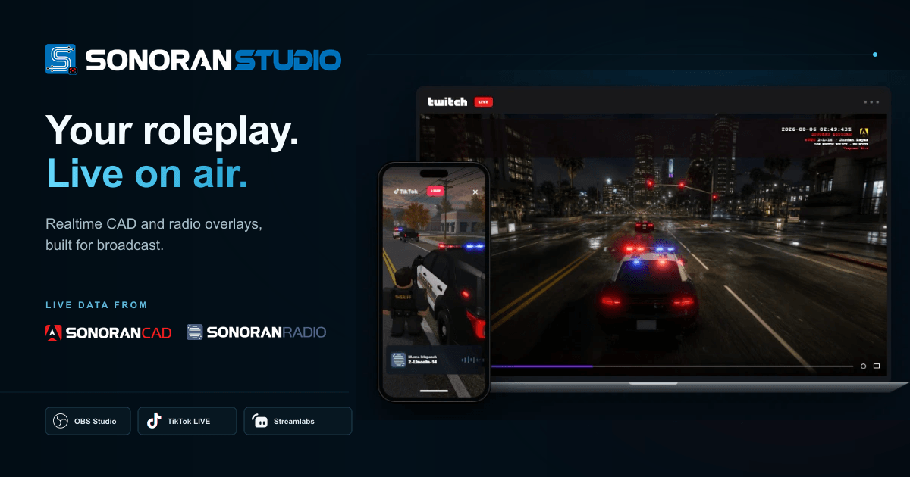

# Sonoran Studio

<figure><figcaption></figcaption></figure>

Sonoran Studio turns live Sonoran CAD and Sonoran Radio activity into broadcast-ready overlays for your stream.

Complete with widget layout customization for all major streaming platforms, smart lighting integrations, and streamer.bot integrations - Sonoran Studio levels your stream up with immersive content like never before.

<table data-view="cards"><thead><tr><th></th><th></th><th></th><th data-hidden data-card-target data-type="content-ref"></th></tr></thead><tbody><tr><td><h3><i class="fa-bolt">:bolt:</i></h3></td><td><strong>Quickstart</strong></td><td>Build and test your first overlay.</td><td></td></tr><tr><td><h3><i class="fa-display">:display:</i></h3></td><td><strong>Add to your stream</strong></td><td>Configure OBS, TikTok LIVE Studio, or Streamlabs.</td><td></td></tr><tr><td><h3><i class="fa-wand-magic-sparkles">:wand-magic-sparkles:</i></h3></td><td><strong>Customize overlays</strong></td><td>Work with layouts, widgets, themes, and sharing.</td><td></td></tr><tr><td><h3><i class="fa-desktop">:desktop:</i></h3></td><td><strong>Desktop companion</strong></td><td>Connect smart lights and Streamer.bot.</td><td></td></tr></tbody></table>
