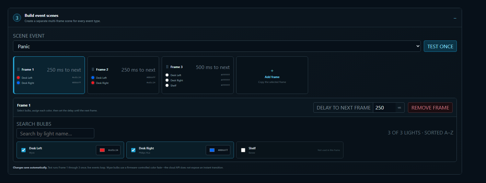
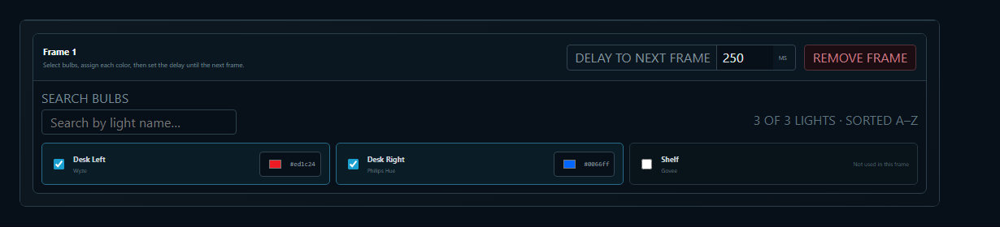

# Smart Lights & Outlets


Smart Lighting requires the [Pro version of Sonoran Studio](pricing.md) and the Windows or macOS desktop app.


## What are Smart Lights & Outlets?

Sonoran Studio controls RGB light color and power, plus smart outlet on/off state, in each scene frame. With the FiveM, LSPDFR, and ER:LC integrations, you can build custom patterns for emergency lights, hazards, and turn signals. The same realtime Sonoran CAD and Radio events that power Studio widgets can trigger device sequences for transmissions, unit updates, calls, dispatch activity, and panic changes.

## Supported Devices

Studio only lists lights that expose the color and power controls required by the selected provider. A product having Wi-Fi, Bluetooth, Matter, Alexa, or Google Home support does **not** by itself guarantee compatibility.


Smart lights are third-party products. Their manufacturers may change or retire cloud and local APIs. Match the exact brand, family, and requirements below before purchasing.


Amazon links point to an exact product page when the model could be verified. Links marked **Amazon search** open a model-specific search; confirm the model or family shown below before ordering.

As an Amazon Associate, Sonoran Software earns from qualifying purchases.

### Smart Lights

Wyze Color

Wyze connects through the Wyze cloud and requires the four account values shown in Studio.

#### Setup

1. Add each color bulb or lightstrip in the Wyze app and confirm it is online.
2. Open the [Wyze developer console](https://developer-api-console.wyze.com/#/apikey/view), sign in with the same account, and create an API key.
3. In Studio, select **Wyze Color** and enter the Wyze email, password, key ID, and API key.
4. Select **Connect Wyze & find lights**. The credentials are encrypted on this computer; use **Re-login** if they change.

Supported color bulbs:

* [Wyze Bulb Color A19, 2-pack](https://www.amazon.com/dp/B08WZ5THJ7?tag=sonoransoftwa-20)
* [Wyze Bulb Color BR30, 2-pack](https://www.amazon.com/dp/B0CJN1FWX7?tag=sonoransoftwa-20)
* [Wyze Light Strip (Amazon search)](https://www.amazon.com/s?k=Wyze+Light+Strip\&tag=sonoransoftwa-20)
* [Wyze Light Strip Pro](https://www.amazon.com/dp/B09K11GNFP?tag=sonoransoftwa-20)

Wyze Light Strip and Light Strip Pro are detected by the current integration and receive a single solid RGB color across the strip. Segment and effect control are not supported. Because Wyze does not publish device-control rate limits for this endpoint, use frame delays of **1,000 ms or longer** for the most reliable sequences.

Official product references: [Bulb Color A19 and BR30](https://support.wyze.com/hc/en-us/articles/360056870611-Wyze-Bulb-Color-Features) and [Light Strip / Light Strip Pro](https://support.wyze.com/hc/en-us/articles/4403317129627-About-Wyze-Light-Strip-and-Wyze-Light-Strip-Pro).

Philips Hue

Philips Hue uses the local Hue Bridge API. A Hue Bridge is required, including for products that can also connect over Bluetooth. Studio supports Hue lights that report full color controls; buy the **White and color ambiance** version, not White or White ambiance.

#### Setup

1. Add the Hue Bridge and color lights in the Hue app and confirm every light works.
2. Keep the Bridge and Studio desktop app on the same local network.
3. Press the round link button on top of the Hue Bridge.
4. In Studio, select **Philips Hue**, leave the optional fields blank, and select **Connect Hue Bridge**. Studio discovers the Bridge and creates a local API username. Advanced users may enter an existing Bridge IP and API username instead.

Compatible Hue families include color A19/BR30 bulbs, Lightstrip Plus and Gradient lightstrips, Play light bars, Go, Iris, Bloom, and Signe lights when paired to a Hue Bridge. Studio sets one color for the whole light and does not address gradient segments or entertainment areas.

* [Starter kit with Hue Bridge and color bulbs](https://www.amazon.com/dp/B09BSHFLD9?tag=sonoransoftwa-20)
* [Single color bulb](https://www.amazon.com/dp/B0FMGTPGGT?tag=sonoransoftwa-20)
* [Color bulb 4-pack](https://www.amazon.com/dp/B0FMH5C2CB?tag=sonoransoftwa-20)
* [Hue Lightstrip Plus base kit](https://www.amazon.com/dp/B08CKJWSFS?tag=sonoransoftwa-20)
* [White and color ambiance BR30 (Amazon search)](https://www.amazon.com/s?k=Philips+Hue+White+and+Color+Ambiance+BR30\&tag=sonoransoftwa-20)
* [Gradient lightstrips (Amazon search)](https://www.amazon.com/s?k=Philips+Hue+Gradient+Lightstrip\&tag=sonoransoftwa-20)
* [Play light bars (Amazon search)](https://www.amazon.com/s?k=Philips+Hue+Play+Light+Bar\&tag=sonoransoftwa-20)
* [Hue Go (Amazon search)](https://www.amazon.com/s?k=Philips+Hue+Go\&tag=sonoransoftwa-20)
* [Hue Iris (Amazon search)](https://www.amazon.com/s?k=Philips+Hue+Iris\&tag=sonoransoftwa-20)
* [Hue Bloom (Amazon search)](https://www.amazon.com/s?k=Philips+Hue+Bloom\&tag=sonoransoftwa-20)
* [Hue Signe (Amazon search)](https://www.amazon.com/s?k=Philips+Hue+Signe\&tag=sonoransoftwa-20)

The Hue API recommends approximately **10 light commands per second**. Studio now queues Bridge writes at 100 ms intervals; use frame delays of at least **100 ms**, and longer delays for large groups. See the official [Hue rate-limit guidance](https://developers.meethue.com/support/) and [Hue Bridge overview](https://www.philips-hue.com/en-us/explore-hue/faq/controls/what-is-the-hue-bridge).

Govee Wi-Fi

Govee connects through the official cloud API and requires a [Govee API key](https://developer.govee.com/docs/getting-started). Studio only displays devices for which Govee reports both `powerSwitch` and `colorRgb`. This capability check is more reliable than assuming every product in a family supports the API.

#### Setup

1. Add every light in the Govee Home app and confirm it is online over Wi-Fi. Bluetooth-only products cannot use this connection.
2. Sign in to the [Govee developer portal](https://developer.govee.com/) with the account that owns the lights and request an API key.
3. In Studio, select **Govee Wi-Fi**, paste the API key, and select **Connect Govee & find lights**.
4. Studio lists only devices whose API capabilities include both RGB color and power control.

API-verified examples from Govee's [official supported-model list](https://developer.govee.com/docs/support-product-model):

* H6008 A19 bulb — [4-pack on Amazon](https://www.amazon.com/dp/B09B7NQT2K?tag=sonoransoftwa-20)
* H605C Envisual TV Backlight T2 — [75–85 inch kit on Amazon](https://www.amazon.com/dp/B0BCQBVSDT?tag=sonoransoftwa-20)
* H607C Floor Lamp 2 — [Amazon](https://www.amazon.com/dp/B0CTH2QF23?tag=sonoransoftwa-20)
* H6062 Glide RGBIC 3D Wall Light — [Amazon](https://www.amazon.com/dp/B091L21GZK?tag=sonoransoftwa-20)
* H7055 Outdoor Pathway Lights — [Amazon search](https://www.amazon.com/s?k=Govee+H7055+Outdoor+Pathway+Lights\&tag=sonoransoftwa-20)

Many other Govee Wi-Fi products may appear automatically when the API reports both required capabilities. Bluetooth-only products are not supported. Studio applies one RGB color to the whole device; RGBIC segments, DreamView, scenes, and music effects are not controlled.

Govee permits **2 control requests per second per device** and **12 per second per account**. Turning a light on with a new color requires two requests. Studio queues requests at 500 ms per device and 84 ms per account; use frame delays of **1,000 ms or longer** for cloud reliability. See Govee's official [device-control API](https://developer.govee.com/reference/control-you-devices).

Nanoleaf

Nanoleaf uses its local OpenAPI on port `16021`; no cloud account or hub is required. Enter the light's IP address or local hostname in Studio. In the Nanoleaf app, choose **Connect to API**, or hold the controller power button for 5–7 seconds, then select **Pair & find Nanoleaf** within 30 seconds.

#### Setup

1. Put the Nanoleaf device and Studio desktop app on the same local network, then find the device IP in the Nanoleaf app or your router.
2. Open the pairing window by choosing **Connect to API** in the Nanoleaf app or holding the controller power button for 5–7 seconds.
3. In Studio, select **Nanoleaf**, enter the IP address or local hostname, and leave the token blank for first-time pairing.
4. Within 30 seconds, select **Pair & find Nanoleaf**. Studio saves the returned local token; an existing token may be pasted when reconnecting.

Studio validates that the device reports RGB hue and saturation controls before adding it. Supported RGB families documented by Nanoleaf include:

* [Shapes](https://www.amazon.com/s?k=Nanoleaf+Shapes\&tag=sonoransoftwa-20), [Canvas](https://www.amazon.com/s?k=Nanoleaf+Canvas\&tag=sonoransoftwa-20), [Lines](https://www.amazon.com/s?k=Nanoleaf+Lines\&tag=sonoransoftwa-20), [Light Panels](https://www.amazon.com/s?k=Nanoleaf+Light+Panels\&tag=sonoransoftwa-20), and [Skylight](https://www.amazon.com/s?k=Nanoleaf+Skylight\&tag=sonoransoftwa-20) (Amazon searches)
* Holiday String Lights NL71K1/NL71K2 — [Amazon search](https://www.amazon.com/s?k=Nanoleaf+NL71K1+NL71K2\&tag=sonoransoftwa-20)
* Indoor HD Lightstrip NL72K1 — [Amazon search](https://www.amazon.com/s?k=Nanoleaf+NL72K1\&tag=sonoransoftwa-20)
* Indoor Lightstrip NL72K3 — [Amazon search](https://www.amazon.com/s?k=Nanoleaf+NL72K3\&tag=sonoransoftwa-20)
* Floor Lamp NL72K4 — [Amazon search](https://www.amazon.com/s?k=Nanoleaf+NL72K4\&tag=sonoransoftwa-20)
* Rope Lights NL72K6 — [Amazon search](https://www.amazon.com/s?k=Nanoleaf+NL72K6\&tag=sonoransoftwa-20)
* Outdoor String Lights NL73K1 — [Amazon search](https://www.amazon.com/s?k=Nanoleaf+NL73K1\&tag=sonoransoftwa-20)
* Permanent Outdoor Lights NL73K3 — [Amazon search](https://www.amazon.com/s?k=Nanoleaf+NL73K3\&tag=sonoransoftwa-20)
* Wi-Fi A19 bulb NL75K1 — [Amazon search](https://www.amazon.com/s?k=Nanoleaf+NL75K1\&tag=sonoransoftwa-20)

Elements panels are not listed because they do not expose the RGB controls Studio requires. Studio controls one solid color for the entire device; panel layouts, per-panel colors, and effects are not controlled.

Nanoleaf's official OpenAPI recommends no more than **10 updates per second**. Studio enforces a 100 ms interval per device. See the official [OpenAPI overview](https://nanoleaf.atlassian.net/wiki/spaces/nlapid/overview), [Light Panels OpenAPI](https://nanoleaf.atlassian.net/wiki/spaces/NOAD1/pages/2789310530), and [Matter Wi-Fi OpenAPI model list](https://nanoleaf.atlassian.net/wiki/spaces/nlapid/pages/2296381472/Nanoleaf%2BMatter%2BWiFi%2BEssentials%2BOpen%2BAPI%2BDocumentation).

LIFX

LIFX connects directly over the official local LAN protocol. No LIFX cloud token, account sign-in, or hub is required. Keep the Studio desktop app and the lights on the same local network, then select **Scan local network for LIFX**.

#### Setup

1. Add the color lights in the LIFX app, update their firmware, and confirm they can display RGB colors.
2. Keep the lights and Studio desktop app on the same local network. Guest Wi-Fi or client isolation must be disabled between them.
3. Allow local UDP port `56700` through the computer firewall if discovery traffic is restricted.
4. In Studio, select **LIFX** and then **Scan local network for LIFX**. No account, hub, address, or token is required.

Studio queries the vendor and product ID of every responding device and checks it against LIFX's official [machine-readable product registry](https://github.com/LIFX/products). A device is listed only when that exact product declares `color: true`. This covers the RGB versions of LIFX Color A19/A21/BR30/GU10 bulbs, Mini Color, Clean, Downlight, Z/Lightstrip, Beam, Tile, Candle Color, Neon, String, Ceiling, Spot, Path, PAR38, Tube, Luna, Mirror, and RGB outdoor families in the current registry.

Amazon links for registry-backed RGB families:

* [Color A19 1100-lumen, 2-pack](https://www.amazon.com/dp/B08FWH238Y?tag=sonoransoftwa-20)
* [Color A21](https://www.amazon.com/s?k=LIFX+Color+A21\&tag=sonoransoftwa-20), [Color BR30](https://www.amazon.com/s?k=LIFX+Color+BR30\&tag=sonoransoftwa-20), and [Color GU10](https://www.amazon.com/s?k=LIFX+Color+GU10\&tag=sonoransoftwa-20) (Amazon searches)
* [Mini Color](https://www.amazon.com/s?k=LIFX+Mini+Color\&tag=sonoransoftwa-20), [Clean](https://www.amazon.com/s?k=LIFX+Clean\&tag=sonoransoftwa-20), and [Color Downlight](https://www.amazon.com/s?k=LIFX+Color+Downlight\&tag=sonoransoftwa-20) (Amazon searches)
* [Z/Lightstrip](https://www.amazon.com/s?k=LIFX+Z+Lightstrip\&tag=sonoransoftwa-20), [Beam](https://www.amazon.com/s?k=LIFX+Beam\&tag=sonoransoftwa-20), and [Tile](https://www.amazon.com/s?k=LIFX+Tile\&tag=sonoransoftwa-20) (Amazon searches)
* [Candle Color](https://www.amazon.com/s?k=LIFX+Candle+Color\&tag=sonoransoftwa-20), [Neon](https://www.amazon.com/s?k=LIFX+Neon\&tag=sonoransoftwa-20), and [String Lights](https://www.amazon.com/s?k=LIFX+String+Lights\&tag=sonoransoftwa-20) (Amazon searches)
* [Ceiling](https://www.amazon.com/s?k=LIFX+Ceiling\&tag=sonoransoftwa-20), [Spot](https://www.amazon.com/s?k=LIFX+Spot\&tag=sonoransoftwa-20), and [Path](https://www.amazon.com/s?k=LIFX+Path\&tag=sonoransoftwa-20) (Amazon searches)
* [Color PAR38](https://www.amazon.com/s?k=LIFX+Color+PAR38\&tag=sonoransoftwa-20), [Tube](https://www.amazon.com/s?k=LIFX+Tube\&tag=sonoransoftwa-20), and [Luna](https://www.amazon.com/s?k=LIFX+Luna\&tag=sonoransoftwa-20) (Amazon searches)
* [Mirror](https://www.amazon.com/s?k=LIFX+Mirror\&tag=sonoransoftwa-20) and [RGB outdoor families](https://www.amazon.com/s?k=LIFX+Outdoor+Color\&tag=sonoransoftwa-20) (Amazon searches)

LIFX White, White-to-Warm, Day & Dusk, Filament, and Switch products are excluded because they do not declare RGB color capability. Unknown product IDs also remain hidden until their capabilities can be verified. Studio applies one solid color to the entire light; it does not address individual Beam, Tile, Candle, String, or lightstrip zones.

LIFX discovery and control use UDP port `56700`. Studio requests an acknowledgement for every command and retries a missing acknowledgement once. LIFX warns clients against excessive LAN message rates but does not publish a numeric request ceiling, so Studio serializes commands per light. Start with frame delays of **100 ms or longer** and increase the delay if Wi-Fi is congested. See the official [LAN discovery guide](https://lan.developer.lifx.com/docs/communicating-with-device), [SetColor/SetPower messages](https://lan.developer.lifx.com/docs/changing-a-device), and [packet header specification](https://lan.developer.lifx.com/docs/packet-contents).

WLED

WLED connects directly to each controller's local JSON API. Studio requires WLED `0.13` or newer so it can verify that at least one segment reports RGB capability. Enter the controller's IP address or local hostname; separate multiple controllers with commas.

#### Setup

1. Install WLED `0.13` or newer, configure the controller and LED output, and verify RGB colors from the WLED web interface.
2. Open the WLED Info screen, WLED app, or router and copy the controller's IP address or `.local` hostname.
3. In Studio, select **WLED** and enter the address. Separate multiple controllers with commas.
4. Select **Connect WLED controller**. Studio verifies RGB capability and represents each controller as one light controlling all configured segments.

Studio treats each WLED controller as one light. A color update switches every configured segment to the Solid effect and applies the same RGB color and full brightness across those segments. Existing per-segment colors and effects are intentionally replaced while a Studio scene is active.

* [WLED pre-installed Wi-Fi controller for 5V WS2811/WS2812B LEDs](https://www.amazon.com/dp/B0BPYR92YP?tag=sonoransoftwa-20)

The linked controller appears on WLED's official [compatible-controller list](https://kno.wled.ge/basics/compatible-controllers/) under Domestic Automation. WLED supports many other pre-flashed and DIY controllers, but the controller, power supply, strip voltage, data signaling, fusing, and wiring must all match. Follow WLED's hardware guidance rather than treating every product whose listing says “WLED” as equivalent.

The WLED API explicitly advises clients not to make requests in parallel. Studio puts all WLED discovery and control requests through one sequential queue and uses the one-call `tt: 0` transition for immediate changes. Use frame delays of **100 ms or longer** for reliable animations, especially with several controllers. See the official [WLED JSON API](https://kno.wled.ge/interfaces/json-api/) and [getting-started guide](https://kno.wled.ge/basics/getting-started/).

### Smart Outlets

Wyze

Wyze connects through the cloud. Studio supports Wyze Plug and each independently exposed outlet on Wyze Outdoor Plug. Use the same Wyze email, password, key ID, and API key described above.

* [Wyze Plug](https://www.amazon.com/dp/B07XZT24B8?tag=sonoransoftwa-20)
* [Wyze Plug Outdoor](https://www.amazon.com/dp/B08NXY7WWX?tag=sonoransoftwa-20)

Govee

Govee connects through the official cloud API key. Supported outlet models are H5080, H5081, H5082, H5083, and H5086.

* [Govee Smart Plug (Wi-Fi + Bluetooth)](https://www.amazon.com/dp/B0948ZZZJP?tag=sonoransoftwa-20)
* [Govee Dual Smart Plug](https://www.amazon.com/dp/B095KG3M4Y?tag=sonoransoftwa-20)
* [Govee Smart Plug with Energy Monitoring](https://www.amazon.com/dp/B0CK28Y67D?tag=sonoransoftwa-20)

Shelly

Shelly works locally with Shelly Plus Plug US and Gen1, Gen2+, Gen3, or Gen4 devices that expose relay or switch outputs. Studio discovers Gen2+ devices through local mDNS. Enter an IP address or hostname for Gen1 devices. No hub or cloud connection is required. Device authentication must be disabled.

* [Shelly Plus Plug US](https://www.amazon.com/dp/B096W3ZZDD?tag=sonoransoftwa-20)

SwitchBot

SwitchBot supports Plug, Plug Mini (US), Plug Mini (JP), and Plug Mini (EU). It uses official OpenAPI v1.1. Enter the token and secret from **Developer Options**. An internet connection is required.

* [SwitchBot Plug Mini (US)](https://www.amazon.com/dp/B0DSJK8B73?tag=sonoransoftwa-20)

## Provider Timing Reference

| Provider    | Connection       | Studio guard                                                          | Recommended frame delay                     |
| ----------- | ---------------- | --------------------------------------------------------------------- | ------------------------------------------- |
| Wyze        | Cloud            | One combined action per light                                         | 1,000 ms or longer                          |
| Philips Hue | Local Hue Bridge | 100 ms between Bridge writes                                          | 100 ms or longer; increase for large groups |
| Govee       | Cloud            | 500 ms/device and 84 ms/account                                       | 1,000 ms or longer                          |
| Nanoleaf    | Local network    | 100 ms/device                                                         | 100 ms or longer                            |
| LIFX        | Local UDP        | Acknowledged commands, one queue per light                            | 100 ms or longer                            |
| WLED        | Local HTTP       | One global sequential request queue                                   | 100 ms or longer                            |
| Shelly      | Local HTTP       | Direct on/off per outlet                                              | 100 ms or longer                            |
| SwitchBot   | Cloud            | Signed OpenAPI command per outlet; 10,000 API calls/day account limit | 1,000 ms or longer                          |

## Creating Device Sequences

Device sequences tell Studio which lights or outlets to use and how long each frame remains active. Each game or CAD/Radio widget event has its own saved sequence.

### 1. Choose a game source

Open **Smart Lighting** in the Sonoran Studio desktop app. Under **Choose your game**, select **FiveM**, **LSPDFR**, or **ER:LC**. The scene editor shows the persistent lighting states supported by that game, FiveM/LSPDFR gameplay moments when available, and the CAD and Radio widget events.

### 2. Connect your devices

Under **Connect devices**, choose your provider and follow the connection steps. After Studio discovers the devices, they are available in every scene and frame.

### 3. Select the event

Under **Build event scenes**, use **Scene event** to select the event family you want to configure, such as **Emergency lights**, **Health threshold**, **Transmission started**, **Status changed**, or **Panic changed**. When a family has multiple choices, Studio adds a second selector beside it. Every final event choice saves a separate sequence.

The grouped choices are:

* **Status changed:** Any status, Available, Unavailable, Busy, En route, or On scene.
* **Transmission started / ended:** My transmission, Other user transmission, or Any transmission. A configured scoped scene takes priority; otherwise Studio falls back to the matching Any transmission scene.
* **Panic changed:** Started or Ended / cleared.
* **Health threshold:** Drops below or Recovers above, with the 0–100 percentage box beside the selector.

**No active game event** is the fallback scene used when FiveM, LSPDFR, or ER:LC is not reporting another active game-lighting state. **Panic active (continuous)** is the persistent panic scene; **Panic changed** contains the optional one-shot start and clear scenes.

### 4. Build the frames

The first frame is created for you. Select smart lights with colors and power, or smart outlets with on/off state. Then set **Delay to next frame** in milliseconds.

Select **Add frame** to copy the selected frame, then change its devices, colors, states, or delay. Drag frame cards to reorder them. A sequence can contain up to 40 frames, and each frame delay can be between 50 and 60,000 milliseconds.

<figure><figcaption>
A three-frame panic sequence using different colors and lights in each frame.
</figcaption></figure>

Each frame can control a different set of devices. A light or outlet not selected in a frame remains unchanged during that frame.

<figure><figcaption>
Select the lights and colors for the active frame, then set the time until the next frame.
</figcaption></figure>

### 5. Test and save

Changes save automatically on this computer. Select **Test once** to play Frame 1 through the final frame one time before going live.

When a live game or unit-status state occurs, Studio loops that saved sequence until another state takes over. A gameplay-moment or CAD/Radio widget-event sequence plays once, holding each frame for its configured delay, and then resumes the newest active game or unit-status scene. A newer one-shot event replaces one already playing, while active panic lighting blocks unrelated events. Testing, direct light control, or another sequence cancels the sequence currently playing.

## FiveM and LSPDFR Gameplay Moments

FiveM and LSPDFR report the same native-backed gameplay moments. Configure them under **FiveM & LSPDFR moments** in the scene selector. Each scene is optional and plays once when the transition occurs.

| Scene event | When it runs |
| --- | --- |
| Weapon drawn | The player changes from unarmed to armed |
| Weapon holstered | The player changes from armed to unarmed; changing weapons emits holstered, then drawn |
| Player died | The player entity changes to dead |
| Player revived | The player entity changes from dead to alive |
| Travel · On foot | The player leaves a vehicle |
| Travel · Vehicle | The player enters a road or other non-air/non-water vehicle class |
| Travel · Aircraft | The player enters a helicopter or plane |
| Travel · Watercraft | The player enters a boat |
| Health threshold > Drops below | Usable player health crosses below the percentage you set |
| Health threshold > Recovers above | After low health, usable health crosses above the percentage you set |

Set each percentage in the **Threshold** box shown beside the Health threshold event, or under **Choose your game > Health event thresholds** after selecting FiveM or LSPDFR. The defaults are **Drops below 35%** and **Recovers above 50%**. Studio requires the recovery value to be above the lower value, creating a gap that prevents rapid switching near one boundary. These settings apply to both smart-device scenes and Streamer.bot actions.

**Player revived** deliberately covers both respawns and framework revives. GTA's entity natives report dead versus alive, but do not identify which recovery flow a server or mod used.

## CAD and Radio Widget Events

The Studio desktop app receives these events through the same authenticated realtime connection used by the overlay widgets. Configure any of them under **CAD & Radio widget events** in the scene selector.

| Scene event                | When it runs                                         |
| -------------------------- | ---------------------------------------------------- |
| Transmission started       | My, another user's, or any radio transmission begins  |
| Transmission ended         | My, another user's, or any radio transmission ends    |
| Radio channel changed      | Your active Radio channel changes                    |
| Status changed             | Any update or the selected CAD status becomes active |
| Call attached              | You attach to a different CAD call                   |
| Attached call changed      | The currently attached call updates                  |
| Call detached              | You detach from the active CAD call                  |
| Call note                  | A dispatch notification is identified as a call note |
| Dispatch notification      | Any other CAD dispatch notification arrives          |
| Panic changed              | A visible panic starts or ends / clears              |

Location-only unit updates do not trigger **Status changed > Any status**, preventing routine location refreshes from repeatedly interrupting lighting. **Any status** is a one-shot scene; a named status scene remains active until the unit status changes. Widget-event scenes are optional: an event with no saved frames leaves the current lighting scene unchanged.

## Integrated Games

### FiveM

FiveM can connect through the latest Sonoran CAD FiveM resource or through the standalone Sonoran Studio resource. The standalone option does not require a CAD community and sends only to the Studio desktop app on the player's computer.

#### Install the standalone resource

1. [Download the standalone FiveM resource](https://github.com/Sonoran-Software/Sonoran-Studio-Releases/releases/download/fivem-latest/Sonoran-Studio-FiveM.zip).
2. Extract the ZIP and copy the `sonoran_studio` folder into the server's `resources` folder.
3. Add `ensure sonoran_studio` to `server.cfg`.
4. Restart the server and keep the Sonoran Studio desktop app open while playing.

Do not run the standalone resource alongside the Sonoran CAD FiveM resource; both contain the Studio bridge and would report every event twice. The default desktop port is `9990`. Players using a different local Studio port can run `/setstudioport PORT` in FiveM.

FiveM scenes include emergency lights, turn signals, hazards, and the gameplay moments listed above. Sonoran CAD unit statuses, calls, Radio activity, and panic events remain available when the player is also signed into the corresponding Sonoran community.

### LSPDFR

The Sonoran Studio LSPDFR plugin synchronizes emergency lights, left and right indicators, hazards, officer details, location, and callout activity through RAGE Plugin Hook. The plugin itself only connects to the Studio desktop app on your computer. When you are signed in, the desktop app sends validated overlay events through your authenticated Studio session.


You need LSPDFR, RAGE Plugin Hook, the Sonoran Studio Windows app, and Studio Pro or Sonoran One.


#### Install the plugin

1. [Download the LSPDFR integration](https://github.com/Sonoran-Software/Sonoran-Studio-Releases/releases/download/lspdfr-latest/Sonoran-Studio-LSPDFR.zip).
2. Close GTA V and RAGE Plugin Hook.
3. Extract the ZIP into your **Grand Theft Auto V** folder. Confirm this file exists: `Grand Theft Auto V\Plugins\SonoranStudio.LSPDFR.dll`.
4. Open RAGE Plugin Hook settings and enable **Load all plugins on startup**.
5. Open the Sonoran Studio Windows app, go to **Lighting**, and select **LSPDFR**.
6. Start GTA V through RAGE Plugin Hook and launch LSPDFR. Keep Sonoran Studio open while playing.

#### Supported lighting and overlay data

| Feature | LSPDFR support |
| --- | --- |
| Emergency lighting | Emergency lights, left indicator, right indicator, and hazards |
| Gameplay moments | Weapon draw/holster, death/return, travel type, and configurable health lower/higher crossings |
| Unit HUD | LSPDFR persona name, agency, current street/area, and derived duty status |
| Attached Call | A locally generated call ID, callout name, and callout street/area after you accept it |
| Dispatch Notification | The callout name, message, and advisory when LSPDFR presents a callout |
| Radio Transmission | Not available from the native LSPDFR API |
| Panic | Not available from the native LSPDFR API |

LSPDFR gameplay moments run the same one-shot scenes as FiveM. Its overlay updates can also run the **Status changed**, **Call attached**, **Call detached**, and **Dispatch notification** event scenes configured in Studio.

Studio derives the unit status from the LSPDFR callout lifecycle: **Available** while patrolling, **En Route** after accepting a callout, **On Scene** near the callout position, and **Unavailable** while off duty. LSPDFR does not expose the player's callsign/unit number, a postal code, or a standard call priority/response code through its native API. These fields remain blank or use your configured widget fallback. Set overlay location precision to **Full** to show LSPDFR street and area names; **Postal only** cannot show an LSPDFR location because no postal is available.

Callout packs control the metadata they expose. If a pack omits a friendly name, message, advisory, or position, Studio shows the remaining supported fields without inventing the missing value.

This support uses LSPDFR's documented callout lifecycle and functions from the [official LSPDFR API project](https://github.com/LMSDev/LSPDFR-API). Gameplay moments use GTA entity, weapon, ped, and vehicle natives through [RAGE Plugin Hook's documented native invocation API](https://ragepluginhook.net/RPH2PreDoc/), cross-checked against the [CitizenFX GTA V native documentation](https://github.com/citizenfx/natives). The callout field and handle patterns are also demonstrated by established open-source integrations including [External Police Computer](https://github.com/jullevistrunz/ExternalPoliceComputer/blob/main/ExternalPoliceComputer/ExternalPoliceComputer/EventListeners/CalloutEvents.cs), [ReportsPlusListener](https://github.com/Guess1m/ReportsPlusListener/blob/master/Utils/Data/EventUtils.cs), and [FirstResponseGPT](https://github.com/NathanWhite-hub/FirstResponse-GPT/blob/master/FirstResponseGPT/Utils/GameUtils.cs).

The plugin sends changes only to `127.0.0.1:9990`; it does not connect directly to a game server or expose a public port. If it does not load, open the RAGE Plugin Hook console with **F4** and run `LoadPlugin "SonoranStudio.LSPDFR.dll"`, then check `RagePluginHook.log` for a Sonoran Studio message.

### ER:LC

Smart lighting for ER:LC reads the lighting and siren controller in the Roblox window. Sonoran CAD and Radio are not required.

Leave the ER:LC ELS controller visible while playing. On macOS, allow Sonoran Studio under **Screen & System Audio Recording** when prompted. Detection remains on your computer; screenshots are never saved or uploaded.
